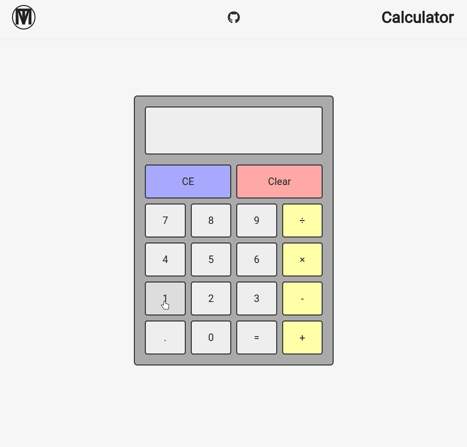

# It's a calculator folks... don't get too excited.
Just kidding, get pumped. This ain't your mama's ordinary ol' calculator. This is a fully functioning and responsive calculator that features operation chaining, fixed precision scientific overflow prevention[^1], unprecedented arithmetic accuracy[^2], strategic operational bookmarking[^3], and a fantastic journey through undefined territory.[^4] *TI-82 who?* 

**Link to project:** [Click me and get to calculatin'!](http://m47o.github.io/)

## How It's Made:

**Tech used:** HTML, CSS, TypeScript

TypeScript was used for creating the evaluation functionality and for updating the operation buttons' styling after an operation is selected. JavaScript's native `eval()` function was intentionally avoided as executing JavaScript from a string is an enormous security risk. Refer to the MDN Web Docs [literally saying the exact same thing](https://developer.mozilla.org/en-US/docs/Web/JavaScript/Reference/Global_Objects/eval#never_use_eval!) (because I copied it and pasted it here).

[^1]: Big number get small and sciency when big number not fit on screen

[^2]: Ever type 2+2 into a calculator and get 6? Yeah, me neither... and you don't have to worry about that happening with this calculator either.

[^3]: Have you ever started a calculation but gotten up halfway through to go prepare a delicious minestrone (with dried chickpeas and a copious amount of hot sauce) only to return and forget which operation you had entered into the calculator? *Me too!* And I built this calculator with you and your soup in mind! Feel free to start a computationally intense calculation (e.g. 10 - 5) and run off to go finish binge-watching Yellowstone. This calculator is brilliant enough to highlight the operation you click so you can give your poor, little brain a rest and come back to finish a calculation later.

[^4]: Just divide by zero a bunch.